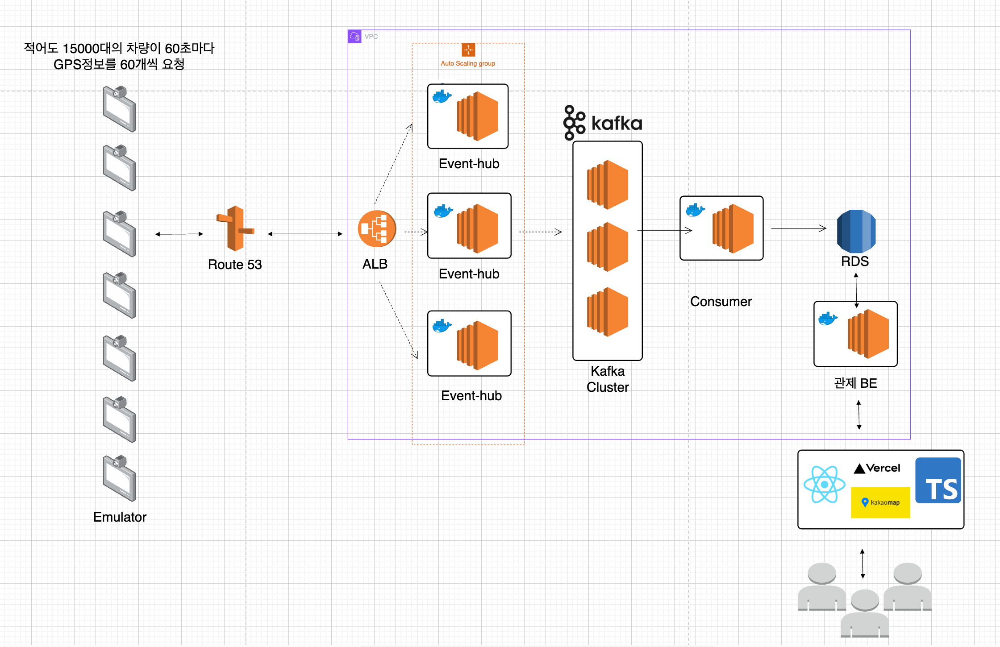
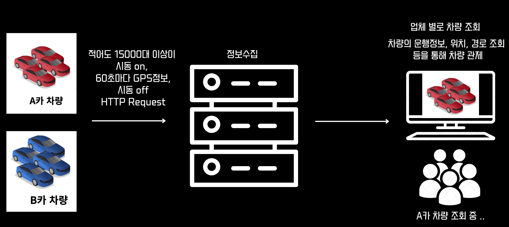
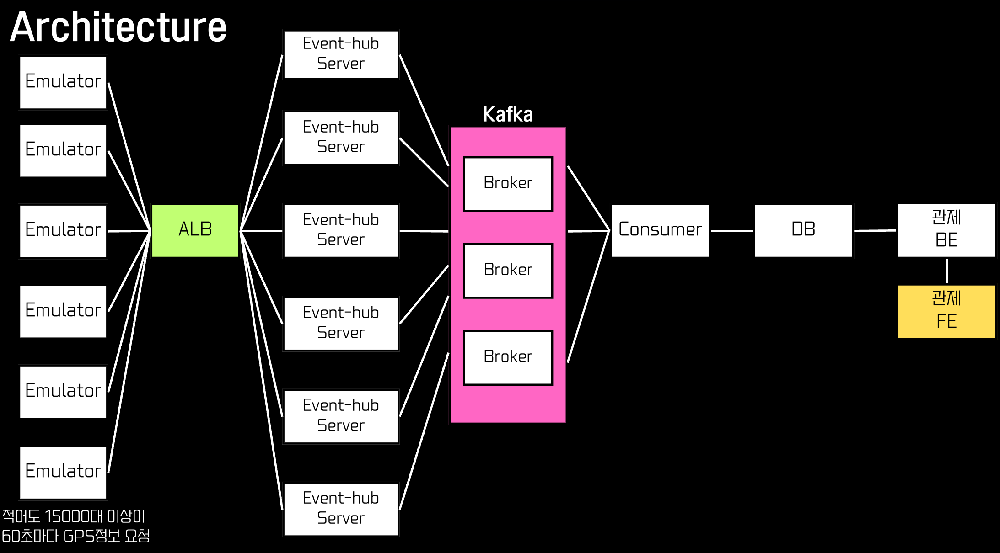
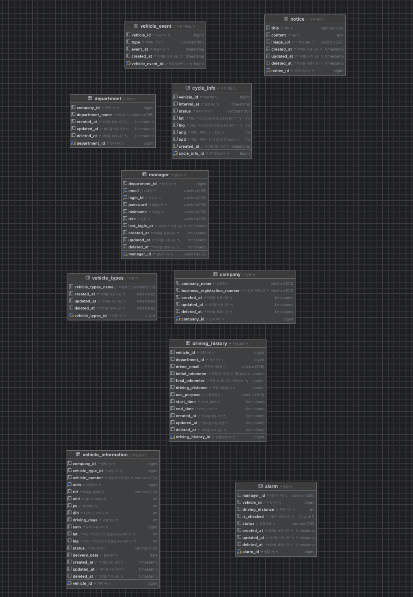

# Monicar 

## 렌터카 차량 관제 서비스 (테크돔 기업 연계 프로젝트)
[모니카 서비스](https://www.monicar.store)

## 서비스 소개
저희 `monicar`는 렌터카 차량 관제 서비스입니다.
적어도 15000대 이상의 애뮬레이터가 시동on, GPS정보, 시동off를 http로 요청합니다.
특히 GPS 정보는, 받는 서버의 부하를 줄이기 위해 1초마다가 아닌, 60초마다 60개의 데이터를 요청합니다.
카프카를 통해 차량의 정보가 올바르게 저장이 되면 업체별로 차량의 운행정보, 위치, 과거 경로 조회, 실시간 경로 조회 등을 기반으로 차량을 관제할 수 있습니다.

## 주요 기능

## 시스템 아키텍처

---

## 위 아키텍처를 도입한 이유

요청한 데이터를 단일 수집서버로는 한계가 있으며, [부하테스트의 결과](https://www.canva.com/design/DAGfcRy6xGE/q6HvKo_qZ0ftXHH79zK6rg/edit?utm_content=DAGfcRy6xGE&utm_campaign=designshare&utm_medium=link2&utm_source=sharebutton)로 인해 메시지 큐를 도입할 수 밖에 없었습니다.

CPU70 이상이 되면 Scale Out, 30이하면 Scale in이 되도록 Auto Scaling을 설정하였습니다.
Event-hub 서버가 60초마다 요청한 60개의 데이터가 카프카를 통해 저장하여, 업체별로 차량의 정보를 조회할 수 있습니다.
실시간 차량을 보여주기 위해, Consumer서버 한대로는 한계가 있어 향후 Consumer서버를 여러대 늘릴 예정입니다.

## 프로젝트 기획
- [피그마 링크]()
- [API명세서](https://www.notion.so/API-2651629b10674069b0500e3ea8aa1a0f?pvs=4)

## ERD

## 기술 스택
### BE

  

  ⚡ Tech Stack: Spring Boot, Spring Data JPA, Spring Security, QueryDSL, MyBatis, JWT, SSE, AWS EC2, AWS RDS, AWS ALB

### FE

  

  🗺️ Tech Stack: Nextjs,Typescript,Vercel, Kakao Map 

## BE Trouble Shooting
- [메시지 큐 중에 Kafka를 도입한 이유](https://github.com/Kernel360/KDEV3_monicar_BE/blob/develop/img/Kafa도입이유.md)
- [Route53 동작이 제대로 안될 때가 있다.](https://github.com/Kernel360/blog/pull/131)
- [부하테스트 - 메시지 큐를 도입할 수 밖에 없었던 이유](https://www.canva.com/design/DAGfcRy6xGE/q6HvKo_qZ0ftXHH79zK6rg/edit?utm_content=DAGfcRy6xGE&utm_campaign=designshare&utm_medium=link2&utm_source=sharebutton)

## 기술 세미나
- [확장가능한 시스템 설계 - 박수현](https://docs.google.com/presentation/d/179fQnnWuqpqkAJLTbvhTNh4YNEe4cjSUiS6bVxZVHAY/edit?usp=sharing)
- [동기 비동기 HTTP 요청 - 윤지윤](https://docs.google.com/presentation/d/1aIru1TdHdLZ956GhZVdg9CFyTxlelEdOxnKPFwaDa2M/edit?usp=sharing)

## 팀원소개
<table>
  <tbody>
    <tr>
      <td align="center">
        <a href="https://github.com/Suxxxxhyun">
           
          <b>팀장(BE, Infra) : 박수현</b>
        </a>
      </td>
      <td align="center">
        <a href="https://github.com/kbyunghoon">
           
          <b>BE 팀원 : 김병훈</b>
        </a>
      </td>
      <td align="center">
        <a href="https://github.com/tomatozil">
           
          <b>BE 팀원 : 윤지윤</b>
        </a>
      </td>
      <td align="center">
        <a href="https://github.com/red-dev-Mark">
           
          <b>FE 팀원 : 권혁준</b>
        </a>
      </td>
      <td align="center">
        <a href="https://github.com/nanafromjeju">
           
          <b>FE 팀원 : 김난아</b>
        </a>
      </td>
    </tr>
  </tbody>
</table>

